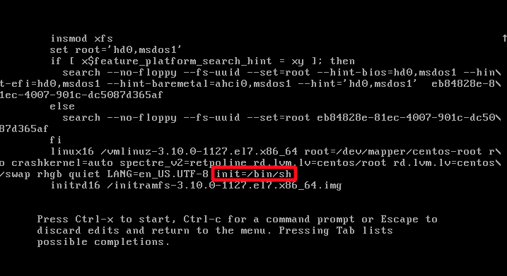
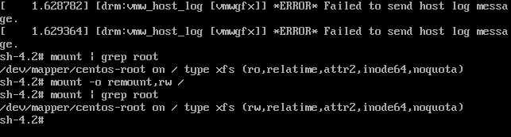
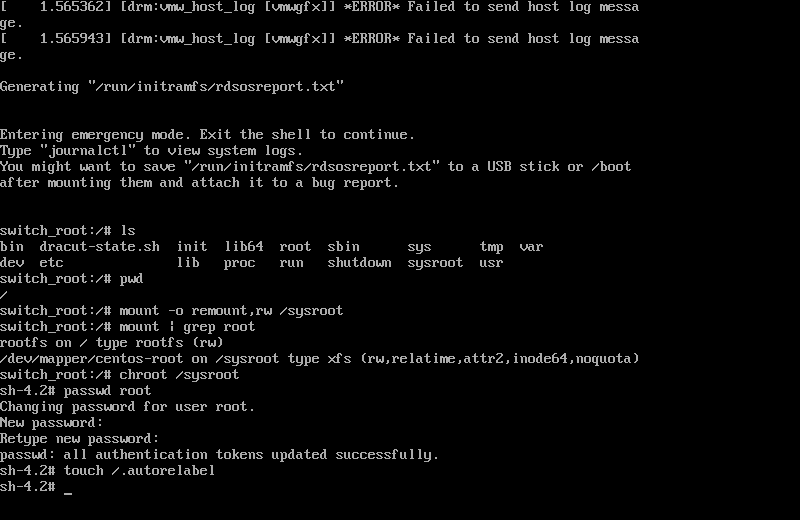
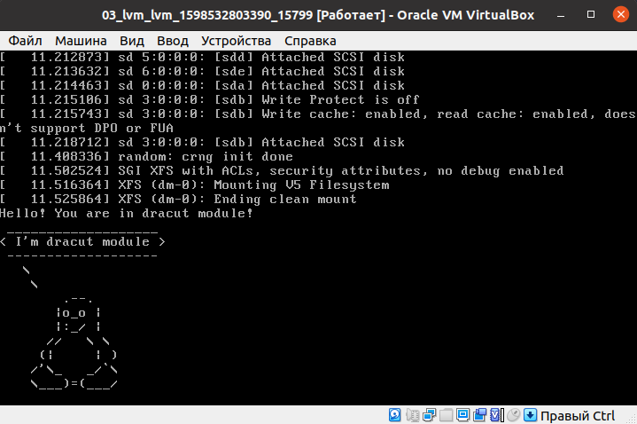

Установлена виртуальная машина CentOS-7.8 не через Vagrant, а через iso

## Пробуем попасть в систему без пароля несколькими способами

Запускаем GUI. При загрузке жмём стрелочку вниз-ввех, выбираем ядро, нажимаем e и попадаем в конфигурирование параметров загрузки

### Способ 1 - init=/bin/sh

В конце строки начинающейся с linux16 добавляем init=/bin/sh и нажимаем сtrl-x для загрузки в систему. 



Всё, мы в системе, но система смонтирована с правами read-only:



```
mount | grep root
```
Перемонтируем в rw
```
mount -o remount,rw /
mount | grep root
```

Теперь командой passwd можем поменять пароль для рута

### Способ 2 - rd.break

В конце той же строки добавляем rd.break и жмём ctrl+x
Попадаем в emergency mode. Наша корневая файловая система смонтирована (опять же в режиме Read-Only), но мы не в ней

Перемонтируем с правами rw
```
mount -o remount,rw /sysroot
```
Меняем корневую директорию с помощью chroot
```
chroot /sysroot
```
Меняем пароль
```
passwd root
```
Так как там работает SELinux, то нужно сделать touch /.autorelabel – когда поменяли пароль, то сбросилась метка безопасности на файле и она стала не валидной, в систему не пустит. А это позволяет переопределить на все файлы метки заново
```
touch /.autorelabel
```


### Способ 3 - rw init=/sysroot/bin/sh

В строке начинающейся с linux16 заменяем ro на rw init=/sysroot/bin/sh и нажимаем сtrl-x для загрузки в систему
Получается то же, что и в предыдущем примере, только сразу смонтировано в Read-Write

## Установить систему с LVM, после чего переименовать VG

Смотрим, что имеем и переименовываем:
```
[root@lvm 01test]# vgs
  VG         #PV #LV #SN Attr   VSize   VFree
  VolGroup00   1   2   0 wz--n- <38.97g    0 
[root@lvm 01test]# vgrename VolGroup00 OtusRoot
  Volume group "VolGroup00" successfully renamed to "OtusRoot"
```
Далее правим /etc/fstab, /etc/default/grub, /boot/grub2/grub.cfg. Везде заменяем старое название на новое. Правил через nano

Пересоздадим initrd image, чтобы он знал новое название Volume Group
```
mkinitrd -f -v /boot/initramfs-$(uname -r).img $(uname -r)
```
Перезагружаемся и видим, что всё прошло успешно:
```
[root@lvm vagrant]# vgs
  VG       #PV #LV #SN Attr   VSize   VFree
  OtusRoot   1   2   0 wz--n- <38.97g    0 
```

## Добавить модуль в initrd

Скрипты модулей хранятся в каталоге /usr/lib/dracut/modules.d/. Для того чтобы добавить свой модуль создаем там папку с именем 01test:
```
mkdir /usr/lib/dracut/modules.d/01test
```
И поместим в неё 2 скрипта

<details>
<summary> module-setup.sh </summary>

```
#!/bin/bash

check() {
    return 0
}

depends() {
    return 0
}

install() {
    inst_hook cleanup 00 "${moddir}/test.sh"
}
```

</details>
<p>

И

<details>
<summary> test.sh </summary>

```
#!/bin/bash

exec 0<>/dev/console 1<>/dev/console 2<>/dev/console
cat <<'msgend'
Hello! You are in dracut module!
 ___________________
< I'm dracut module >
 -------------------
   \
    \
     	.--.
       |o_o |
       |:_/ |
      //   \ \
     (|     | )
    /'\_   _/`\
    \___)=(___/
msgend
sleep 10
echo " continuing...."
```

</details>
<p>

Пересобираем образ initrd
```
mkinitrd -f -v /boot/initramfs-$(uname -r).img $(uname -r)
```
Проверяем добавился ли наш модуль в образ
```
[root@lvm 01test]# lsinitrd -m /boot/initramfs-$(uname -r).img | grep test
test
```
Редактируем grub.cfg и убираем опции rghb и quiet, чтобы была задержка в 10 секунд и увидеть вывод
В итоге увидели пингвина Tux

